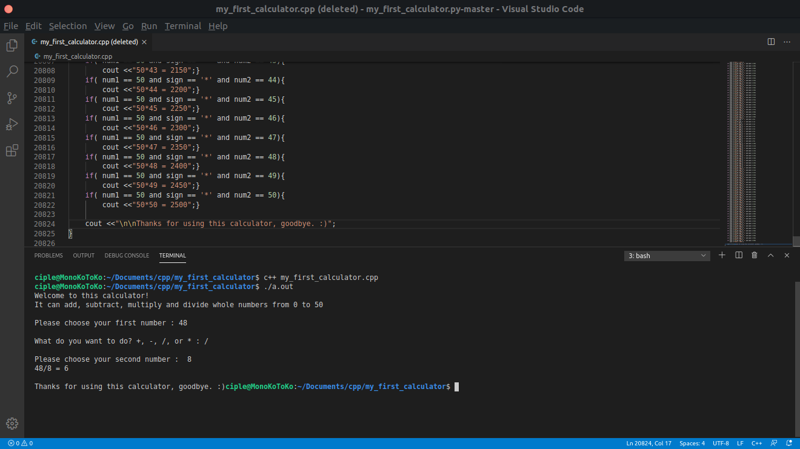
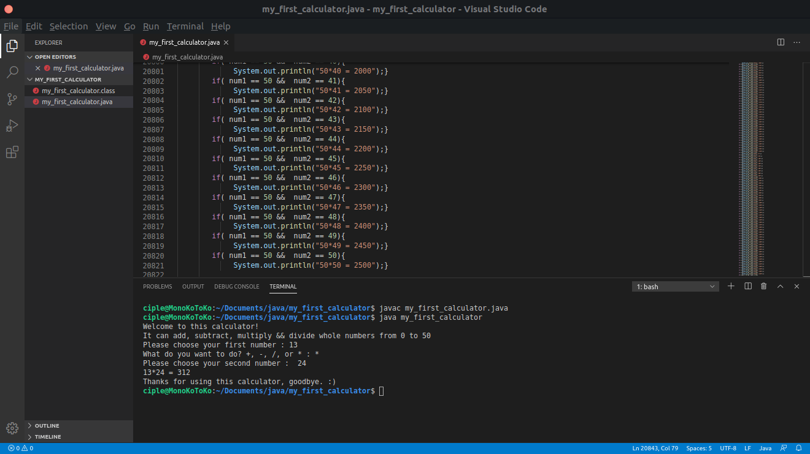
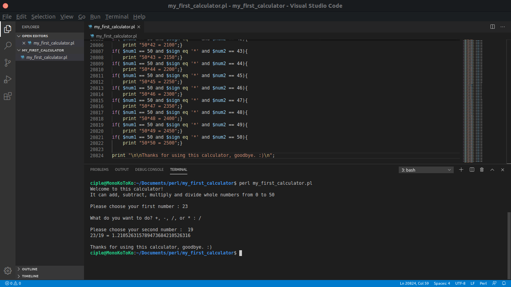
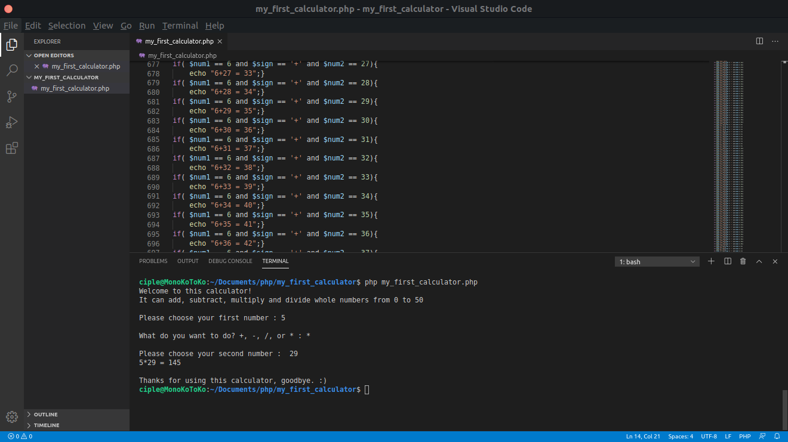
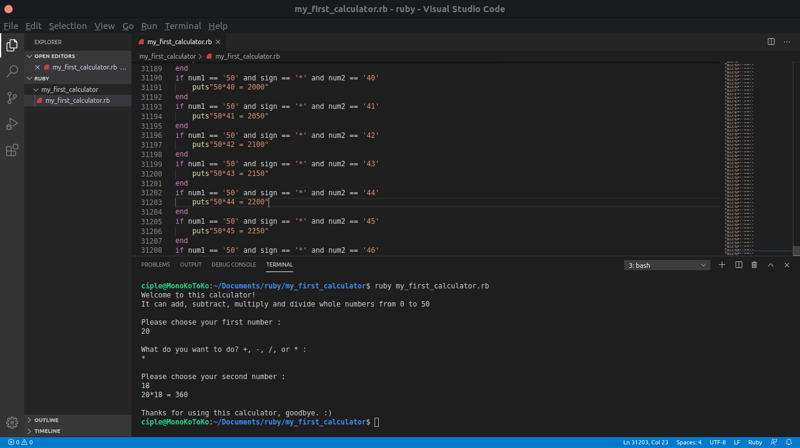

# My First Calculator

> it's a joke

I look the original repo which is over [here](https://github.com/AceLewis/my_first_calculator.py), it's on python and I decided to make it on another language.

## C++
```bash
c++ my_first_calculator.cpp
./a.out
```
<br>

## Java
```bash
javac my_first_calculator.java
java my_first_calculator
```
<br>

## Perl
```bash
perl my_first_calculator.pl
```
<br>

## Php
```bash
php my_first_calculator.php
```
<br>

## Ruby
```bash
Ruby my_first_calculator.rb
```
<br>


